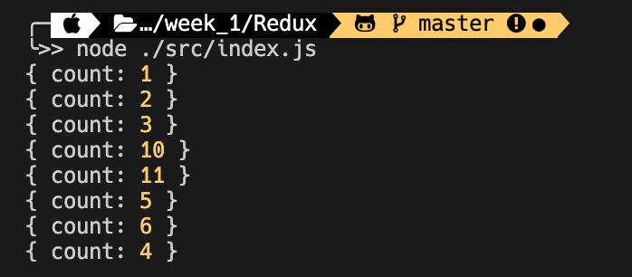

## 우아한 테크러닝 React&Typescript 2회차

2020년 09월 03일 목요일

<details><summary>Table of Contents</summary>

-   Javascript의 타입과 변수 선언법 [:link:](#javascript의-타입과-변수-선언법)
-   Javascript의 값 [:link:](#javascript의-값)
-   Javascript의 함수 [:link:](#javascript의-함수)
-   ES6 이후 변형된 함수 문법 [:link:](#es6-이후-변형된-함수-문법)
-   new 연산자와 함수와 인스턴스 객체 [:link:](#new-연산자와-함수와-인스턴스-객체)
-   ES6이후의 클래스 [:link:](#es6이후의-클래스)
-   this와 실행 컨텍스트 [:link:](#this와-실행-컨텍스트)
-   클로저 [:link:](#클로저)
-   비동기와 Promise [:link:](#비동기와-promise)
-   Flux 패턴 [:link:](#flux-패턴)
-   Redux 만들어보기 [:link:](#redux-만들어보기)

</details>

### Javascript의 타입과 변수 선언법

Javascript의 타입은 **원시 타입**과 **객체 타입**으로 구분되며 변수는 아래와 같이 선언할 수 있다.<br/>

```javascript
var x = 10;
let y = 10;
const y = 10;
```

### Javascript의 값

아래의 코드에서 `x`는 **변수**이며 `10`은 **값**에 해당한다.<br/>

```javascript
let x = 10;
```

Javascript에서 값이라고 정의한 것들은 변수에 넣을 수 있다.<br/>
값에 해당하는 데이터는 문자열, 숫자, 객체등이 존재한다.<br/>

```javascript
function foo() {}
let y = foo;
```

Javascript에서는 **함수 또한 객체**이며 위와 같이 변수에 할당 가능하다.<br/>
Javascript에서 모든 함수는 `undefined`나 `return`으로 명시된 값을 반환한다.<br/>

### Javascript의 함수

> Javascript에서의 함수는 값이며 모든 값은 변수에 대입될 수 있다.<br/>
> Javasript에서 실행 결과가 값이 되는 것은 **식**이며 그 외의 모든 것은 **문**이다.<br/>

Javascript에서 함수를 정의하는 방법은 **함수 정의문**과 **함수 정의식**이 존재한다.<br/>

-   함수 정의문

```javascript
function foo() {}
```

-   함수 정의식

```javascript
const bar = function bar() {};
bar();
```

호출한 `bar()`의 이름은 함수 정의식에서 오른쪽에 대입된 함수의 이름이 아니다.<br/>
오른쪽에 정의된 함수의 이름은 `bar`변수에서는 알 수 없는 **익명 함수**가 된다.<br/>

-   IIFE

```javascript
(function () {})();
```

익명 함수를 값으로 만들어 사용하기 위해서는 익명 함수를 `()`로 감싸 **즉시 호출**하면 된다.<br/>

-   함수의 매개변수와 반환값으로서의 함수

```javascript
function foo(x) {
    x();
    return function () {};
}

const y = foo(function () {});
```

**함수는 값으로 취급**되기 때문에 위와 같이 매개변수 `x`의 형태로 함수를 전달할 수 있다.<br/>
또한 `foo` 함수의 반환값으로 함수가 반환될 수 있으며 반환된 함수는 변수에 저장할 수 있다.<br/>
위와 같이 함수를 매개변수로 넘겨주는 것을 **콜백 함수**라고 하며 **호출을 위임**하는 역할을 한다.<br/>
소프트웨어 공학에서 함수를 인자로 받고 함수를 반환하는 함수를 **1급 함수** (High Order Function)이라고 한다<br/>

### ES6 이후 변형된 함수 문법

ES6이전에서 함수식을 만들때 아래와 같이 만들 수 있다.<br/>

```javascript
const foo = function (x) {};
```

위의 `foo` 함수에서 `foo` 함수를 **재귀호출**하기 위해서는 오른쪽에 대입된 함수의 이름이 필요하다.<br/>

```javascript
const foo = function foo() {
    foo();
};
```

ES6 이후에서 함수식을 만들때 `=>`를 이용한 **화살표 함수**로 만들 수 있다.<br/>

```javascript
const bar = (x) => {};
```

**화살표 함수**는 한줄 함수, 람다 함수라고도 불리며 아래와 같이 **하나의 식을 반환하는 경우** 자주 사용된다.<br/>

```javascript
const bar = (x) => x * 2;
```

**화살표 함수**는 인자가 하나일 경우 `()`를 생략할 수 있으며 한줄로 구성될 경우 `return` 생략이 가능하다.<br/>

```javascript
const foo = x => 10;
const boar = (x, y) => x * y;
```

### new 연산자와 함수와 인스턴스 객체

`new` 연산자를 호출하면 `this`를 생성하며 인스턴스 객체를 생성된 `this`를 반환한다.<br/>

```javascript
function foo() {
    this.age = 10;
}

const y = new foo();
console.log(y); // { age: 10, constructor: object }
```

생성된 인스턴스 객체 `y`를 출력하면 `constructor`가 추가되어 반환되는 것을 볼 수 있다.<br/>
생성된 객체의 타입을 확인하기 위해서는 `instanceof`를 `y instanceof foo`와 같이 사용할 수 있다.<br/>

### ES6이후의 클래스

함수를 `new` 연산자를 이용해 인스턴스를 생성할 수 있지만 ES6이후 부터는 아래와 같이 **클래스 문법**을 제공한다.<br/>

```javascript
class bar {
    constructor() {
        this.age = 10;
    }
}

console.log(new bar()); // { age: 10, constructor: object }
```

보기에는 비슷하지만 코드 구조적인 부분에서 `class`를 이용하면 조금 더 명시적이다.<br/>

```javascript
function foo() {
    this.age = 10;
}

foo(); // undefined
new foo(); // { age: 10 }
```

또한 작성된 함수가 인스턴스를 위한 함수이지만 해당 기능으로의 사용을 강제할 수 없다.<br/>

### this와 실행 컨텍스트

아래 코드에서 `this.name`은 `person`객체의 `name`을 가리킨다.<br/>

```javascript
const person = {
    name: "김민수",
    getName() {
        return this.name;
    },
};

console.log(person.getName()); // 김민수
```

`this`가 결정되는 방식들은 **실행 컨텍스트**로 호출시에 결정된다.<br/>

```typescript
const man = person.getName;

console.log(man());
```

위의 코드에서 `man`은 `getName`함수를 저장해 `man()`과 같이 호출할 수 있다.<br/>
하지만 `man`이 호출되는 시점의 **실행 컨텍스트**는 **전역 객체**이므로 `name`이 존재하지 않아 오류가 발생한다.<br/>

```typescript
const man = person.getName.bind(person);

console.log(man()); // 김민수
person.getName.call(person); // 김민수
```

`this`를 고정하기 위해서는 `bind`, `call`, `apply` 함수를 사용할 수 있다.<br/>

### 클로저

아래의 코드에서 `foo` 함수는 `bar` 함수를 반환한다.<br/>

```javascript
function foo(x) {
    return function bar() {
        return x;
    };
}

const f = foo(10);
console.log(f()); // 10
```

`bar`함수를 담은 `f`는 `f()`와 같이 호출할 수 있으며 `10`을 반환한다.<br/>
위의 코드의 `bar`함수에서 접근하는 `x`변수는 `bar`함수 스코프의 외부 범위다.<br/>
`foo` 함수가 호출이 완료된 시점에서 `foo`의 스코프는 사라지지만 반환된 `bar`에서는 `x`를 기억한다.<br/>
위와 같이 함수 실행결과로 **반환된 함수가 외부의 스코프를 기억하고 있는 상태**를 **클로저**라고 한다.<br/>

```javascript
function makePerson() {
    let age = 10;
    return {
        getAge() {
            return age;
        },
        setAge(x) {
            age = x > 1 && x < 130 ? x : age;
        },
    };
}

p = makePerson();
console.log(p.getAge()); // 10
p.setAge(500);
console.log(p.getAge()); // 10
p.setAge(20);
console.log(p.getAge()); // 20
```

**클로저**를 사용하면 `p.age`와 같이 접근할 수 없으며 위와 같이 값을 **캡슐화**해 보호할 수 있다.<br/>

### 비동기와 Promise

아래와 같이 `setTimeout`이나 `API`를 호출하는 경우 코드가 **비동기적**으로 실행된다.<br/>

```javascript
setTimeout(function () {
    console.log("foo");
    setTimeout(function () {
        console.log("bar");
    }, 2000);
}, 1000);
```

위의 코드는 비동기적인 로직을 2 depth를 갖는다. 하지만 더 깊이가 깊어질 경우 **콜백 헬**이 발생한다.<br/>
비동기 로직 작성시 **콜백 헬**과 같은 코드를 방지하기 위해 나온 것이 `Promise`다.<br/>

```javascript
const p1 = new Promise((resolve, reject) => {
    setTimeout(() => {
        resolve("응답1");
    }, 1000);

    reject();
});

const p2 = new Promise((resolve, reject) => {
    setTimeout(() => {
        resolve("응답2");
    }, 1000);

    reject();
});

p1.then(p2())
    .then(function (r) {
        console.log(r);
    })
    .catch(function () {});
```

`Promise`의 `then`의 콜백 함수는 `resolve`로 호출되며 `catch`로 넘겨준 콜백 함수는 `reject`로 호출된다.<br/>
`Promise`를 조금 더 가독성이 좋게 만들기 위해서 `async - await`을 이용할 수 있다.<br/>

```javascript
const delay = (ms) => new Promise((resolve) => setTimeout(resolve, ms));

async function main() {
    console.log("1");
    try {
        const result = await delay(3000);
    } catch (e) {
        console.error(e);
    }
    console.log("2");
}

main();
```

위의 코드를 실행해보면 콘솔에 `1`이 출력된 후 3초 뒤에 `2`가 출력된다.<br/>
`await`은 `async`키워드가 붙은 함수에서 사용 가능하며 `Promise`의 `resolve`된 값을 저장할 수 있다.<br/>
`Promise`의 `reject`는 `try-catch`구문의 `catch`를 이용해 사용할 수 있다.<br/>

### Flux 패턴

어플리케이션에서 여러 개의 컴포넌트에서 하나의 특정 상태가 필요한 경우가 생긴다.<br/>
`Flux` 패턴은 하나의 `store`에서 상태에 관한 정보를 저장해 사용하는 패턴이다.<br/>
**가상돔** 사용 이전의 어플리케이션은 하나의 상태가 변경될 시 모든 화면이 다시 그려지기 때문에 불가능 했다.<br/>
React에서는 **가상돔**을 사용해 기존의 DOM과 비교해 **다른 부분만 DOM에 반영**하기 때문에 가능해졌다.<br/>

### Redux 만들어보기

`redux`의 `store`에 저장된 데이터는 컴포넌트가 직접적으로 데이터를 바꿀 수 없다.<br/>
상태를 직접적으로 바꿀 수 없도록 하기위해 **클로저**를 이용해 `state`를 은닉화한다.<br/>
`createStore`를 이용해 `store`를 생성할 수 있고 `getState`를 이용해 상태를 볼 수 있다.<br/>
`store`에 저장된 값은 반드시 `reducer`함수가 호출되어 변경되어야 한다.<br/>
`reducer`는 반드시 `action`을 인자로 받는 `dispatch`를 이용해 호출되어야 한다.<br/>
`reducer`는 호출될 때 기존 **저장된 상태**와 실행할 **액션 객체**를 매개변수로 전달 받는다.<br/>
**액션 객체**의 타입에 `type`에따라 기존 `state`의 값을 변경시켜 `store`에 저장된다.<br/>
`subscribe`함수는 `store`를 구독하는 `listener` 배열에 받은 `fn`을 저장해 `dispatch`시 마다 실행한다.<br/>

-   `redux.js`

```javascript
export function createStore(reducer) {
    let state;
    const listener = [];
    const publish = () => {
        listener.forEach(({ subscriber, context }) => {
            subscriber.call(context);
        });
    };
    const dispatch = (action) => {
        state = reducer(state, action);
        publish();
    };
    const subscribe = (subscriber, context = null) => {
        listener.push({ subscriber, context });
    };
    const getState = () => ({ ...state });

    return {
        getState,
        dispatch,
        subscribe,
    };
}

export function actionCreator(type, payload = {}) {
    return {
        type,
        payload: { ...payload },
    };
}
```

-   `index.js`

아래와 같이 실제 `redux`와 동일하게 `reducer`를 작성할 수 있다.<br/>

```javascript
import { createStore, actionCreator } from "./redux";

const INIT = "init";
const INCREMENT = "increment";
const RESET = "reset";

function reducer(state = {}, { type, payload }) {
    switch (type) {
        case INIT: {
            return {
                ...state,
                count: payload.count,
            };
        }
        case INCREMENT:
            return { ...state, count: state.count ? state.count + 1 : 1 };
        case RESET:
            return {
                ...state,
                count: 0,
            };
        default:
            return { ...state };
    }
}

```

액션을 조금 더 쉽게 `dispatch`하기 위해 아래와 같은 헬퍼 함수들을 이용할 수 있다.<br/>

- `init` : `store`의 값을 count로 초기화              
- `increment` : `store`의 count를 1증가 또는 1로 설정 
- `reset` : `store`의 count를 0으로 초기화            

```javascript
function init(count) {
    store.dispatch(actionCreator(INIT, { count }));
}

function increment() {
    store.dispatch(actionCreator(INCREMENT));
}

function reset() {
    store.dispatch(actionCreator(RESET));
}
```

아래와 같이 실제 `store`를 생성하고 `subscribe` 함수를 이용해 로깅 또한 진행할 수 있다.<br/>

1. `createStore` 함수로 **스토어**를 생성     
2. `getState` 함수를 사용해 값을 출력하는 함수 작성  
3. **스토어**의 `subscribe` 메서드를 이용해 2번에서 작성한 함수로 구독 

```javascript
const store = createStore(reducer);

function update() {
    console.log(store.getState());
}

store.subscribe(update);
```

아래와 같은 방법으로 `action`을 `dispatch`해 `store`에 저장된 상태를 변경할 수 있다.<br/>

1. `type`과 `payload`을 포함한 **액션**을 `dispatch`
2. **액션**을 반환하는 `actionCreator` 헬퍼 함수를 사용한 후 `dispatch`
3. `payload`를 전달받아 `dispatch`까지 해주는 헬퍼 함수 이용

```javascript
store.dispatch({ type: INCREMENT }); // { count: 1 }
store.dispatch(actionCreator(INCREMENT)); // { count: 2 }
increment(); // { count: 3 }

store.dispatch({ type: INIT, payload: { count: 5 } }); // { count: 5 }
store.dispatch(actionCreator(INIT, { count: 0 })); // { count: 0 }
init(10); // { count: 10 }

store.dispatch({ type: RESET }); // { count: 0 }
store.dispatch(actionCreator(RESET)); // { count: 0 }
reset(0); // { count: 0 }
```

`actionCreator`, `increment`, `reset`함수는 액션을 조금 더 간단히 `dispatch`하도록 도와주는 헬퍼함수다.<br/>



위와 같이 우리가 사용하던 `redux`와 비슷하게 작동하는 것을 볼 수 있다.<br/>
실제 작성한 코드는 [여기](https://github.com/textuel/Woowa_Tech_Learning_React_Typescript/tree/master/ms/week_1/Redux_Implement)에서 확인할 수 있다.<br/>