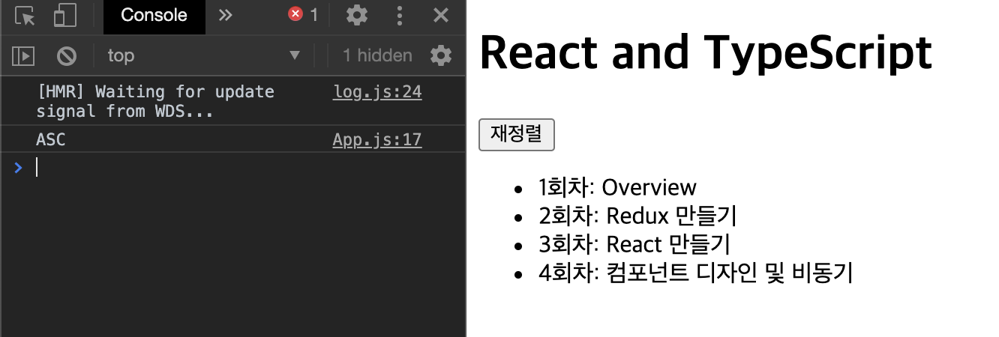
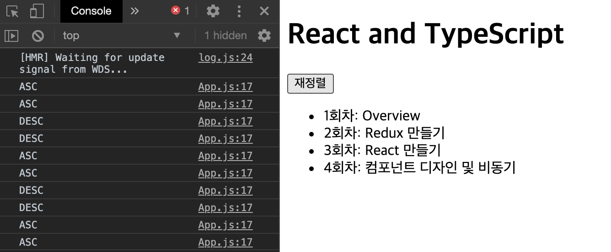
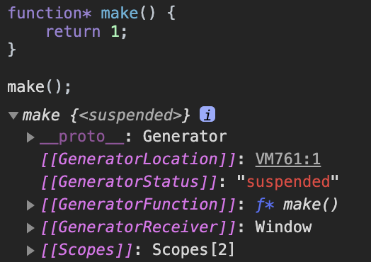
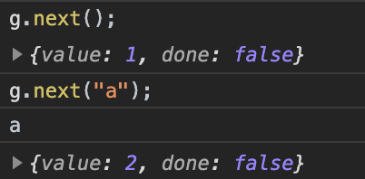
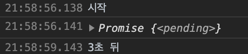

## 우아한 테크러닝 React&Typescript 4회차

2020년 09월 10일 목요일

<details><summary>Table of Contents</summary>

-   함수 컴포넌트의 상태와 컴포넌트 분리 [:link:](#함수-컴포넌트의-상태와-컴포넌트-분리)
-   제너레이터와 비동기 [:link:](#제너레이터와-비동기)
-   제너레이터 [:link:](#제너레이터)

</details>

### 함수 컴포넌트의 상태와 컴포넌트 분리

아래와 같은 `React` 어플리케이션을 하나 생성한다.<br/>

-   `index.js`

```javascript
import React from "react";
import ReactDOM from "react-dom";
import App from "./App";

ReactDOM.render(
    <React.StrictMode>
        <App />
    </React.StrictMode>,
    document.getElementById("root")
);
```

-   `App.js`

```javascript
import React from "react";

const App = () => {
    return (
        <div>
            <header>
                <h1>React and TypeScript</h1>
            </header>
            <ul>
                <li>1회차: Overview</li>
                <li>2회차: Redux 만들기</li>
                <li>3회차: React 만들기</li>
                <li>4회차: 컴포넌트 디자인 및 비동기</li>
            </ul>
        </div>
    );
};

export default App;
```

위의 `App.js`에서 `li` 태그 내부에 있는 값들이 상태라고 볼 수 있다.<br/>
`li` 태그 내부의 데이터를 `index.js`에 분리해 속성으로 `App` 컴포넌트에 넘겨줄 수 있다.<br/>

-   `index.js`

```javascript
...
const sessionList = [
    { title: "1회차: Overview" },
    { title: "2회차: Redux 만들기" },
    { title: "3회차: React 만들기" },
    { title: "4회차: 컴포넌트 디자인 및 비동기" },
];

ReactDOM.render(
    <React.StrictMode>
        <App store={{ sessionList }} />
    </React.StrictMode>,
    document.getElementById("root")
);
```

위와 같이 `index.js`를 수정하면서 `App` 컴포넌트 또한 아래와 같이 수정될 수 있다.<br/>

-   `App.js`

```javascript
...
const App = (props) => {
    const { sessionList } = props.store;

    return (
        <div>
            <header>
                <h1>React and TypeScript</h1>
            </header>
            <ul>
                {sessionList.map((session) => (
                    <li>{session.title}</li>
                ))}
            </ul>
        </div>
    );
};
...
```

하지만 현재 코드는 `map`메서드 내부에 `li` 태그를 생성하는 방식을 가지고 있다.<br/>
태그를 반환하는 코드가 많아질 경우 가독성을 해치므로 컴포넌트를 한번 더 **분리**할 수 있을 것이다.<br/>

-   `App.js`

```javascript
...
const SessionItem = ({ title }) => <li>{title}</li>;

const App = (props) => {
    const { sessionList } = props.store;

    return (
        <div>
            <header>
                <h1>React and TypeScript</h1>
            </header>
            <ul>
                {sessionList.map((session) => (
                    <SessionItem title={session.title} />
                ))}
            </ul>
        </div>
    );
};
...
```

위 코드의 `SessionItem`과 `App` 컴포넌트는 **상태를 가지고 있지 않는 컴포넌트**다.<br/>
`App` 컴포넌트의 재정렬 버튼을 누르면 오름차순, 내림차순을 바꿔보여줄 수 있도록 만들고자 한다.<br/>

-   `App.js`

```javascript
...
const App = (props) => {
    const { sessionList } = props.store;
    const orderedSessionList = sessionList.map((session, i) => ({
        ...session,
        order: i,
    }));

    return (
        <div>
            <header>
                <h1>React and TypeScript</h1>
            </header>
            <button>재정렬</button>
            <ul>
                {orderedSessionList.map((session) => (
                    <SessionItem title={session.title} />
                ))}
            </ul>
        </div>
    );
};
...
```

목록을 정렬하는 기준에 대한 상태를 저장하기 위해 아래와 같은 방법을 생각해볼 수 있다.<br/>

```javascript
const App = (props) => {
    let displayOrder = "ASC";
    const { sessionList } = props.store;
    const orderedSessionList = sessionList.map((session, i) => ({
        ...session,
        order: i,
    }));

    const toggleDisplayOrder = () => {
        displayOrder = displayOrder === "ASC" ? "DESC" : "ASC";
    };

    return (
        <div>
            <header>
                <h1>React and TypeScript</h1>
            </header>
            <button onClick={toggleDisplayOrder}>재정렬</button>
            <ul>
                {orderedSessionList.map((session) => (
                    <SessionItem title={session.title} />
                ))}
            </ul>
        </div>
    );
};
```

`displayOrder` 라는 변수를 선언하고 `ASC`와 `DESC`를 변환하는 `toggleDisplayOrder` 함수를 만들었다.<br/>
버튼의 `onClick`이벤트에 `toggleDisplayOrder` 함수를 넣어 `displayOrder` 변경하려고자 한다.<br/>

<br/>

하지만 버튼을 아무리 클릭해도 위와 같이 `displayOrder` 값은 변경되지 않으며 다시 렌더링되지 않는다.<br/>
`React`의 함수 컴포넌트에서 **상태**를 만들기 위해서는 `useState`라는 **Hook**을 사용한다.<br/>

```javascript
import React, { useState } from "react";
```

`App` 컴포넌트를 아래와 같이 수정해 `useState`를 이용해 `displayOrder` 상태를 만들 수 있다.<br/>

```javascript
const App = (props) => {
    const [displayOrder, setDisplayOrder] = useState("ASC");
    const { sessionList } = props.store;
    const orderedSessionList = sessionList.map((session, i) => ({
        ...session,
        order: i,
    }));

    const toggleDisplayOrder = () => {
        setDisplayOrder(displayOrder === "ASC" ? "DESC" : "ASC");
    };

    console.log(displayOrder);

    return (
        <div>
            <header>
                <h1>React and TypeScript</h1>
            </header>
            <button onClick={toggleDisplayOrder}>재정렬</button>
            <ul>
                {orderedSessionList.map((session) => (
                    <SessionItem key={session.id} title={session.title} />
                ))}
            </ul>
        </div>
    );
};
```

`useState`의 인자는 상태의 초깃값이며 `[상태, 상태를 변경하는 함수]` 형태의 배열을 반환한다.<br/>

<br/>

`useState`의 반환값 중 상태를 변경하는 함수를 이용해 `setState`와 같게 상태를 변경할 수 있다.<br/>
위의 사진과 같이 `displayOrder` 변수가 `ASC`와 `DESC`로 번갈아가며 바뀌는 것을 볼 수 있다.<br/>

### 제너레이터와 비동기

**제너레이터**는 아래와 같이 `funtion *` 키워드로 선언한다.<br/>

```javascript
function* foo() {}
```

**비동기 함수**는 아래와 같이 `function`에 `async` 키워드를 붙여 사용한다.<br/>

```javascript
async function bar() {}
```

**제너레이터**와 **비동기 함수**는 `Promise`와 밀접한 연관이 있다.<br/>
아래의 코드는 동기적으로 실행되는 Javascript 코드의 예시다.<br/>

```javascript
const x = 10;
const y = x * 10;
```

위의 코드들은 `y` 변수에 `x`라는 의존성이 있으므로 `x`가 없이 `y`가 생길 수 없다.<br/>

```javascript
const x = () => 10;
const y = x() * 10;
```

하지만 위의 코드는 `x`의 값이 확정되는 순간은 `y`의 호출 시점이 된다.<br/>
Javascript는 함수를 반환할 수 있다는 특성 때문에 `x`와 같이 **지연 호출**이 가능하다.<br/>

```javascript
const p = new Promise(function (resolve, reject) {
    setTimeout(() => {
        resolve("1");
    }, 1000);
});

p.then(function (r) {
    console.log(r);
});
```

`Promise` 객체 또한 해소되어도 위와 같이 `resolve`가 지연 호출될 수 있다.<br/>

### 제너레이터

**제너레이터**는 **코루틴**이라는 함수의 구현체다.<br/>
**제너레이터**라는 이름이 붙은 이유는 어떤 값을 계속 생산하기 때문이다.<br/>

```javascript
function* make() {
    return 1;
}

console.log(make());
```

일반적인 함수의 경우 `make` 함수의 반환값은 `1`이 될 것이다.<br/>

<br/>

하지만 `function*` 키워드로 선언된 **제너레이터**는 위와 같이 객체가 반환된다.<br/>
실제 **제너레이터**는 아래와 같이 `function*` 키워드와 `yield` 키워드롤 사용한다.<br/>

```javascript
function* makeNumber() {
    let num = 1;

    while (true) {
        yield num++;
    }
}
```

아래와 같이 `makeNumber()`와 같이 **제너레이터**를 생성해도 값이 반환되지 않는다.<br/>

```javascript
const g = makeNumber();
```

실제 **제너레이터**의 값을 가져오기 위해서는 **제너레이터 객체**의 `next` 메서드를 이용해야 한다.<br/>

```javascript
console.log(g.next());
```

`next` 메서드를 호출하면 아래와 같이 객체를 반환한다.<br/>

<br/>

객체의 `value`는 `yield`로 반환된 값이며 `done`은 `true`가 될 경우 **제너레이터**가 종료된다.<br/>
**제너레이터**의 `next`함수는 또한 값을 받을 수 있다.<br/>

```javascript
function* makeNumber() {
    let num = 1;

    while (true) {
        const x = yield num++;
        console.log(x);
    }
}

const g = makeNumber();

console.log(g.next());
console.log(g.next("a"));
```

아래와 같이 `next`에 매개변수로 넘겨준 `a`가 `yield`의 반환값으로 담겨 출력되는 것을 볼 수 있다.<br/>

<br/>

**제너레이터**를 이용해 아래와 같은 상황의 코드도 작성할 수 있다.<br/>

```javascript
const delay = (ms) => new Promise((resolve) => setTimeout(resolve, ms));

function* main() {
    console.log("시작");
    yield delay(3000);
    console.log("3초 뒤");
}

const it = main();

const { value } = it.next();

value.then(() => {
    it.next();
});
```

위의 코드를 실행시키면 `"시작"`이 출력되고 3초가 흐른뒤 `"3초 뒤"`가 출력된다.<br/>

<br/>

`async-await`을 사용한 것과 비슷하게 `delay`함수가 종료될때까지 기다리게 된다.<br/>
`async-await`은 반환값이 `Promise` 객체인 경우에만 사용할 수 있는 키워드다.<br/>
하지만 위와 같이 **제너레이터**를 이용하는 경우 `Promise` 형태의 값이 반환되지 않아도 사용가능 하다.<br/>
적용 가능한 범위가 넓기 때문에 `redux-saga`에서는 **제너레이터**를 사용해 **비동기**를 처리한다.<br/>
