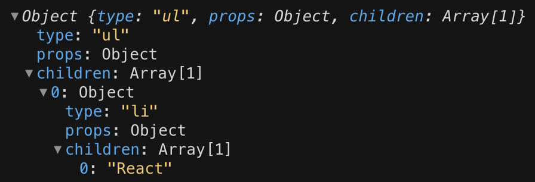
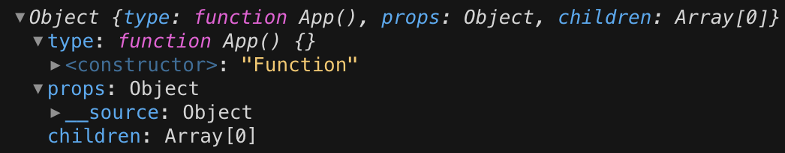
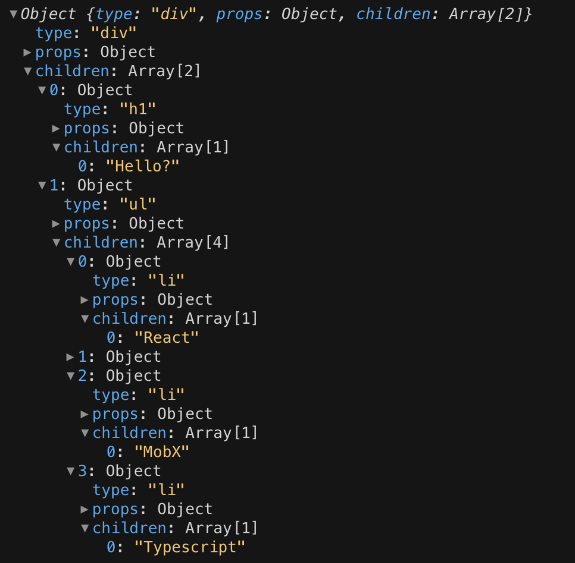
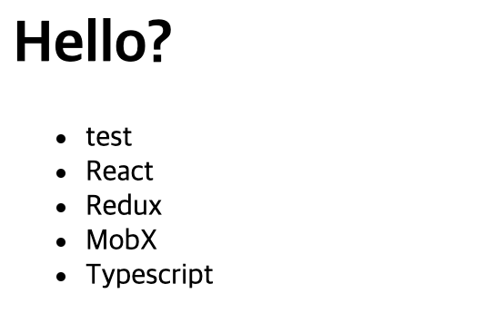
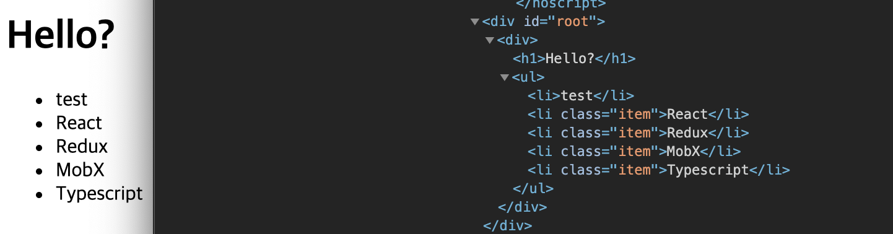

## 우아한 테크러닝 React&Typescript 3회차

2020년 09월 08일 목요일

<details><summary>Table of Contents</summary>

-   React가 개발된 이유 [:link:](#react가-개발된-이유)
-   React와 Virtual DOM 이해하기 [:link:](#react와-virtual-dom-이해하기)
-   React 만들어보기 [:link:](#react-만들어보기)
-   React의 컴포넌트와 상태 관리 [:link:](#react의-컴포넌트와-상태-관리)

</details>

### React가 개발된 이유

`React`의 사상을 이해하는데에 문제 없을 정도의 핵심적인 부분을 만들어본다.<br/>

-   `index.js`

```javascript
const list = [
    { title: "React에 대해 알아봅시다." },
    { title: "Redux에 대해 알아봅시다." },
    { title: "Typescript에 대해 알아봅시다." },
];

const rootElement = document.getElementById("root");
```

위와 같이 `list`와 같은 데이터를 기반으로 Javscript로 화면을 그리는 방법은 아래와 같다.<br/>

```javascript
const list = [
    { title: "React에 대해 알아봅시다." },
    { title: "Redux에 대해 알아봅시다." },
    { title: "Typescript에 대해 알아봅시다." },
];

const rootElement = document.getElementById("root");

function app() {
    rootElement.innerHTML = `
        <ul>
            ${list.map((item) => `<li>${item.title}</li>`).join("")}
        </ul>
    `;
}

app();
```

`rootElement`의 `innerHTML`을 이용해 문자열 Element를 생성해 직접적으로 넣어줄 수 있다.<br/>
위와 같이 작성한 `app` 함수를 아래와 같이 변경시켜 **순수 함수**로 만들 수 있다.<br/>

```javascript
function app(items) {
    rootElement.innerHTML = `
        <ul>
            ${items.map((item) => `<li>${item.title}</li>`).join("")}
        </ul>
    `;
}

app(list);
```

하지만 위의 `app` 함수는 `innerHTML` 같이 `DOM`에 직접 접근해 구조를 변경하고 있다.<br/>
`DOM`에 직접 접근하는 것은 규모가 커지게되면 복잡해질 수 있으므로 사용하지 않는 것이 좋다.<br/>
이러한 문제를 해결하기 위해서 *Facebook*이 `React`라는 라이브러리를 개발하게 되었다.<br/>
브라우저는 `HTML`이라는 텍스트 데이터를 `DOM`이라는 트리 구조의 데이터로 변환해 관리한다.<br/>
`React`는 `DOM`을 `Virtual DOM`으로 변환해 조금 더 간단하게 개발자가 사용할 수 있도록 만들었다.<br/>

### React와 Virtual DOM 이해하기

기본적인 `React`의 구조는 아래와 같이 구성된다.<br/>

```javascript
import React from "react";
import ReactDOM from "react-dom";

function App() {
    return (
        <div>
            <h1>Hello?</h1>
            <ul>
                <li>React</li>
                <li>Redux</li>
                <li>MobX</li>
                <li>Typescript</li>
            </ul>
        </div>
    );
}

ReactDOM.render(<App />, document.getElementById("root"));
```

`App` 함수의 반환값은 `JSX` 문법이며 `HTML` 태그와 비슷하게 사용해 컴포넌트를 만든다.<br/>
`ReactDOM`은 `render`라는 **정적메서드**를 가지며 2개의 인자를 받는다.<br/>
첫 번째 인자는 화면에 렌더링할 컴포넌트이며 두 번째는 컴포넌트를 렌터링할 요소다.<br/>
위의 코드를 아래와 같이 컴포넌트를 분리할 수 도 있다.<br/>

```javascript
import React from "react";
import ReactDOM from "react-dom";

function StudyList() {
    return (
        <ul>
            <li>React</li>
            <li>Redux</li>
            <li>MobX</li>
            <li>Typescript</li>
        </ul>
    );
}

function App() {
    return (
        <div>
            <h1>Hello?</h1>
            <StudyList />
        </div>
    );
}

ReactDOM.render(<App />, document.getElementById("root"));
```

`App` 내부에 있던 `ul > li` 컴포넌트들을 `StudyList` 함수로 만들어 분리했다.<br/>
컴포넌트를 분리하면서 `StudyList` 같이 이름을 갖는 함수가 생기며 코드를 관리하기 더 쉬워졌다.<br/>
또한 `JSX`에도 `HTML`과 동일하게 태그에 속성을 사용할 수 있다.<br/>

```javascript
function StudyList() {
    return (
        <ul>
            <li className="item">React</li>
            <li className="item">Redux</li>
            <li className="item">MobX</li>
            <li className="item">Typescript</li>
        </ul>
    );
}
```

`HTML`에서는 `class` 속성을 사용하지만 `JSX`에서는 `className`을 사용한다.<br/>
위의 `StudyList` 함수에서 반환하는 `JSX` 엘리먼트들을 객체로 바꾸어 표현하면 아래와 같다.<br/>

```javascript
const vdom = {
    type: "ul",
    props: {},
    children: [
        { type: "li", props: { className: "item" }, children: "React" },
        { type: "li", props: { className: "item" }, children: "Redux" },
        { type: "li", props: { className: "item" }, children: "Typescript" },
        { type: "li", props: { className: "item" }, children: "MobX" },
    ],
};
```

`<StudyList/>`에 속성을 넘기는 경우 `StudyList` 함수는 아래와 같이 바뀔 것이다.<br/>

```javascript
function StudyList(props) {
    return (
        <ul>
            <li className="item">React</li>
            <li className="item">Redux</li>
            <li className="item">MobX</li>
            <li className="item">Typescript</li>
        </ul>
    );
}

function App() {
    return (
        <div>
            <h1>Hello?</h1>
            <StudyList item="abcd" id="hoho" />
        </div>
    );
}
```

위와 같이 변경된 코드에 따라 생기는 `StudyList`의 `Virtual DOM`은 아래와 같을 것이다.<br/>

```javascript
const vdom = {
    type: "ul",
    props: { item: "abcd", id: "hoho" },
    children: [
        { type: "li", props: { className: "item" }, children: "React" },
        { type: "li", props: { className: "item" }, children: "Redux" },
        { type: "li", props: { className: "item" }, children: "Typescript" },
        { type: "li", props: { className: "item" }, children: "MobX" },
    ],
};
```

위와 같이 생성된 객체를 `render` 메서드가 실제 `HTML` 태그로 변경시켜 화면에 그려준다.<br/>
위의 `vdom` 객체 구성에 따라 `React`는 하나의 부모에서 아래의 자식들을 만드는 방식을 갖는다.<br/>

### React 만들어보기

`React` 구현되어 있는 `createElement` 함수는 아래와 같이 구성되어 있다.<br/>

```javascript
function createElement(type, props = {}, ...children) {
    return { type, props, children };
}
```

`type`은 태그의 타입이며 `props`는 컴포넌트의 속성 `children`은 가변인자이며 자식 요소를 받는다.<br/>

```javascript
const vdom = createElement("ul", {}, createElement("li", {}, "React"));
```

위와 같이 `createElement`를 사용하면서 `Virtual DOM` 객체를 만들 수 있다.<br/>

<br/>

위와 같이 임의로 작성했던 `vdom` 객체와 `createElemnt` 함수로 만들어진 결과가 같다.<br/>

```javascript
/* @jsx createElement */

function createElement(type, props = {}, ...children) {
  return { type, props, children };
}

...

console.log(<App />);
```

`React` 관련 모듈과 `render` 메서드 부분을 지운 후 `<App />` 출력해보면 아래와 같은 결과가 출력된다.<br/>

<br/>

`JSX` 코드가 동일하게 컴파일 되지만 우리가 작성한 `Virtual DOM` 객체와 조금 다르게 생겼다.<br/>
`createElemnt` 함수의 첫번째 인자인 `type`이 `function App() {}`으로 표현된다.<br/>

```javascript
function createElement(type, props = {}, ...children) {
    if (typeof type === "function") {
        return type.apply(null, [props, ...children]);
    }

    return { type, props, children };
}
```

위와 같이 `createElement` 함수를 수정해 `type` 매개변수의 타입을 확인하는 로직을 추가하면된다.<br/>
`type`이 함수일 경우 `apply`를 이용해 기존의 매개변수를 그대로 넣어 호출한다.<br/>

<br/>

이전에 작성한 `vdom`과 동일하게 객체가 구성되는 것을 확인할 수 있다.<br/>
`createElement`로 생성된 객체를 실제 `DOM`으로 구성하는 `render` 함수는 아래와 같이 작성할 수 있다.<br/>

```javascript
function renderElement(node) {
    if (typeof node === "string") {
        return document.createTextNode(node);
    }
    const el = document.createElement(node.type);

    node.children.map(renderElement).forEach((element) => {
        el.appendChild(element);
    });

    return el;
}

function render(vdom, container) {
    container.appendChild(renderElement(vdom));
}
```

**재귀함수**를 이용해 `node`의 타입이 문자열이 될 때까지 반복해 생성하게 된다.<br/>
`props`를 넘겨받는 아래와 같은 컴포넌트의 경우에도 동일하게 적용된다.<br/>

```javascript
function Row(props) {
    return <li>{props.label}</li>;
}

function StudyList(props) {
    return (
        <ul>
            <Row label="test" />
            <li className="item">React</li>
            <li className="item">Redux</li>
            <li className="item">MobX</li>
            <li className="item">Typescript</li>
        </ul>
    );
}
```

아래와 같이 `ReactDOM`의 `render` 함수와 동일하게 작성한 `render` 함수를 사용할 수 있다.<br/>

```javascript
render(<App />, document.getElementById("root"));
```

아래와 같이 `React`를 사용한 것과 동일하게 `DOM`이 그려지는 것을 볼 수 있다.<br/>

<br/>

실제 `React`의 경우 `render` 함수의 경우 기존의 `Virtual DOM`과 비교하는 로직이 추가되어 있을 것이다.<br/>
강의에서는 `className`을 `class` 속성으로 넣는 부분이 없어 `renderElement`를 수정하였다.<br/>

```javascript
function renderElement(node) {
    if (typeof node === "string") {
        return document.createTextNode(node);
    }

    const el = document.createElement(node.type);

    const { className } = node.props;
    className && el.setAttribute("class", className);

    node.children.map(renderElement).forEach((element) => {
        el.appendChild(element);
    });

    return el;
}
```

아래와 같이 `props`에 `className`이 있을 경우 `class` 속성이 노드에 추가되는 것을 볼 수 있다.<br/>

<br/>

`class`나 `id` 같은 속성의 경우 간단하게 추가되지만 이벤트는 고려할게 많을 것 같다는 생각이 든다.<br/>

### React의 컴포넌트와 상태 관리

`React`의 컴포넌트는 **함수 컴포넌트**와 **클래스 컴포넌트**가 존재한다.<br/>

#### 클래스 컴포넌트

클래스 컴포넌트는 **라이프사이클 API**가 존재하며 **상태**를 **생성자에서 초기화**할 수 있다.<br/>

```jsx
class Hello extends React.Component {
    constructor(props) {
        super(props);

        this.state = {
            count: 1,
        };
    }

    componentDidMount() {
        this.setState({ count: this.state.count + 1 });
    }

    render() {
        return <p>안녕하세요!</p>;
    }
}
```

상태를 변경하기 위해서는 `React.Component`에 존재하는 `setState` 메서드를 사용한다.<br/>
클래스 컴포넌트의 상태는 객체의 생성자에 초기화되기 때문에 `React`가 지우지 않는이상 유지된다.<br/>

#### 함수 컴포넌트

초기의 함수 컴포넌트는 상태를 갖지 못하는 컴포넌트로 여겨졌다.<br/>
함수 컴포넌트의 상태는 함수가 **호출될 때 마다 생성되기 때문에** 유지될 수 없었기 때문이다.<br/>
아래의 `App` 컴포넌트의 `x`와 같은 함수 내부의 변수가 상태처럼 여겨졌다.<br/>

```javascript
function App() {
    let x = 10;
    return (
        <div>
            <h1>상태</h1>
            <Hello />
        </div>
    );
}
```

함수 컴포넌트는 **Hooks**가 등장하면서 상태를 관리할 수 있게 되었다.<br/>
클래스 컴포넌트처럼 상태를 관리하기위해서는 `useState`를 사용한다.<br/>

```javascript
import React, { useState } from "react";

function App() {
    const [count, setCount] = useState(1);

    return (
        <div>
            <h1>상태</h1>
            <Hello />
        </div>
    );
}
```

`useState`의 반환 배열은 첫번째는 **상태값**이며 두번째는 `dispatcher`로 사용되는 **함수**다.<br/>
아래와 같이 `h1` 태그에 `onClick` 이벤트를 주어 `dispatcher`를 사용해 상태를 변경할 수 있다.<br/>

```javascript
import React, { useState } from "react";

function App() {
    const [count, setCount] = useState(1);

    return (
        <div>
            <h1 onClick={() => setCounter(count + 1)}>상태 {count}</h1>
            <Hello />
        </div>
    );
}
```

`h1` 태그를 클릭할 시 `count`라는 **상태**가 1씩 증가하는 것을 볼 수 있다.<br/>
`setCount` 함수는 클래스 컴포넌트에서 `setState`와 같은 역할을 한다.<br/>
따라서 `setCount` 함수가 호출되면 상태가 변경되었음을 `React`에서 알 수 있다.<br/>
**Hooks**는 전역 배열로 관리되며 생성되는 순서에 따라 컴포넌트를 `key`로하여 인덱스로 관리된다.<br/>
**Hooks**를 사용하는 컴포넌트 관련 **정보가 없을 경우** 처음 실행되는 것으로 판단되어 **초기값이 저장**된다.<br/>
컴포넌트 관련 정보가 있을 경우 **기존의 상태**가 저장되어 있기 때문에 **저장된 값을 반환해 사용**한다.<br/>
_최상위(at the Top Level)에서만 Hook을 호출해야 합니다._ 라는 [Hooks 규칙](https://ko.reactjs.org/docs/hooks-rules.html)도 이 이유에서 작성되었다.<br/>
최상위가 아닌 부분에서 호출될 경우 전역 배열에 문제가 발생해 **원하지 않는 값을 반환하는 경우가 생길 수 있다**.<br/>
