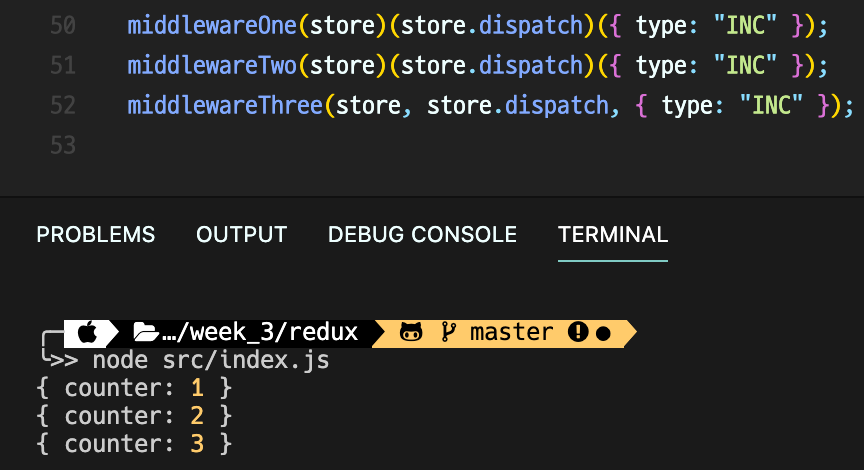
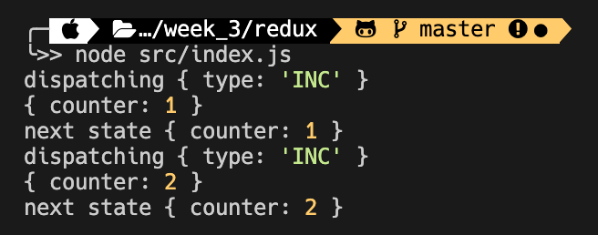
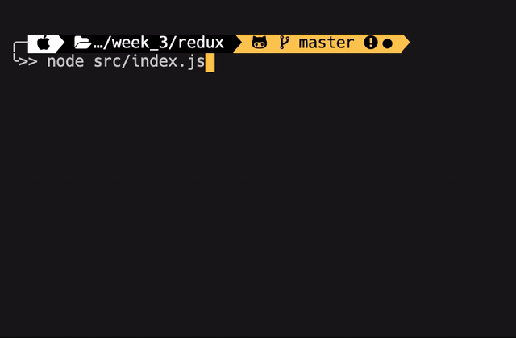
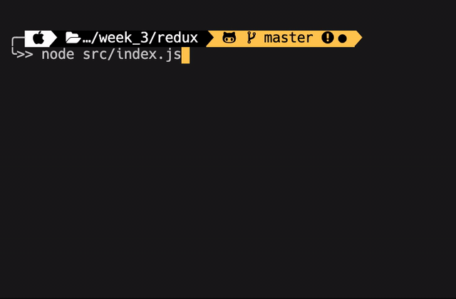

## 우아한 테크러닝 React&Typescript 5회차

2020년 09월 15일 화요일

<details><summary>Table of Contents</summary>

-   Javascript로 구현한 Redux 리뷰 [:link:](#javascript로-구현한-redux-리뷰)
-   커링 [:link:](#커링)
-   Redux의 비동기와 미들웨어 [:link:](#redux의-비동기와-미들웨어)
-   구현한 Redux에 미들웨어 추가하기 [:link:](#구현한-redux에-미들웨어-추가하기)

</details>

### Javascript로 구현한 Redux 리뷰

지난 번에 작성했던 `redux` 코드를 사용해 아래와 같이 `store`와 `reducer`를 생성한다.<br/>

```javascript
import { createStore } from "./redux";

function reducer(state = { counter: 0 }, action) {
    switch (action.type) {
        case "INC":
            return {
                ...state,
                counter: state.counter + 1,
            };
        default:
            return { ...state };
    }
}

const store = createStore(reducer);
```

상태의 변경사항을 알기 위해 `subscribe` 메서드를 이용해 변경사항을 확인한다.<br/>

```javascript
store.subscribe(() => {
    console.log(store.getState());
});
```

`subscribe` 메서드의 인자인 콜백 함수는 `store`의 상태를 반환하는 `getState` 메서드를 콘솔로 출력한다.<br/>
아래와 같이 `store`의 `dispatch` 메서드를 이용해 `action`을 실행할 수 있다.<br/>

```javascript
store.dispatch({ type: "INC" }); // { counter: 1 }
store.dispatch({ type: "INC" }); // { counter: 2 }
```

위의 로직들은 각각 따로 작동하는 것 같지만 모든 과정들은 **동기적**으로 진행된다.<br/>
모든 로직이 **동기적**으로 작동하기 때문에 `reducer`는 반드시 **순수 함수**여야 한다.<br/>

> 멱등성 : 연산을 여러 번 적용하더라도 결과가 달라지지 않는 성질<br/>

위와 같이 `redux`를 사용하는 로직에서 실행할 때 마다 결과가 다를 수 있는 경우가 존재한다.<br/>
순수하지 않은 로직의 예시로는 **비동기** 작업이 있으며 **API 통신**이 대표적이다.<br/>

### 커링

```javascript
const add1 = function (a, b) {
    return a + b;
};

const add2 = function (a) {
    return function (b) {
        return a + b;
    };
};
```

`add1` 함수는 1차 함수이며 `add2` 함수는 함수를 반환하는 2차 함수로 작성되어 있다.<br/>
`add2` 함수는 아래와 같이 사용자가 함수가 실행되는 시점에 영향을 줄 수 있다.<br/>

```javascript
const addTen = add2(10);
console.log(addTen(20)); // 30
console.log(addTen(120)); // 130
```

`add1` 함수의 경우에는 `add1(10, 20)`과 같이 호출하게 되면 바로 실행된다.<br/>
`add2` 함수는 위와 같이 한번 더 함수를 호출해야 그때야 함수가 **지연 호출**되게 된다.<br/>

### Redux의 비동기와 미들웨어

아래와 같이 `type`이 `FETCH_USER`인 **비동기 로직**을 처리하는 액션을 생각할 수 있다.<br/>

```javascript
store.dispatch({ type: "FETCH_USER" });
```

`setTimeout`을 이용해 **비동기**와 동일하게 동작하는 `api` 함수를 만들었다.<br/>

```javascript
function api(url, cb) {
    setTimeout(() => {
        cb({ type: "응답", data: [] });
    }, 2000);
}
```

위와 같이 `reducer`에 `FETCH_USER`을 처리하는 `case`문을 추가했다.<br/>

```javascript
function reducer(state = { counter: 0 }, action) {
    switch (action.type) {
        case "INC":
            return {
                ...state,
                counter: state.counter + 1,
            };
        case "FETCH_USER":
            api("/api/users/1", (users) => {
                return { ...state, ...users };
            });
        default:
            return { ...state };
    }
}
```

하지만 `Redux`는 모든 로직을 동기적으로 처리하기 때문에 값을 기다리지 않는다.<br/>
따라서 `Redux`에서 **비동기 작업**을 처리하기 위해서는 **미들웨어**를 이용해야 한다.<br/>

> 미들웨어는 수도관 중간의 소독망이나 거름망 같은 역할을 한다.<br/>
> 데이터가 흘러가는 과정 중간에 거쳐가기 때문에 미들웨어라고 불린다.<br/>
> 미들웨어는 연결된 순서에 따라 흐르기 때문에 항상 같은 순서대로 처리된다.<br/>

```javascript
const middlewareOne = (store) => (dispatch) => (action) => {
    dispatch(action);
};

function middlewareTwo(store) {
    return function (dispatch) {
        return function (action) {
            dispatch(action);
        };
    };
}

function middlewareThree(store, dispatch, action) {
    dispatch(action);
}
```

`middlewareOne`과 `middlewareTwo` 함수는 3개의 인자를 3개의 함수로 쪼갠 **커링**을 이용한다.<br/>
**커링**을 이용한 `middlewareOne`과 `middlewareTwo` 함수는 아래와 같이 실행할 수 있다.<br/>

```javascript
middlewareOne(store)(store.dispatch)({ type: "INC" });
middlewareTwo(store)(store.dispatch)({ type: "INC" });
```

하지만 매개변수가 3개인 `middlewareThree`는 아래와 같이 함수의 인자 3개를 한번에 전달한다.<br/>

```javascript
middlewareThree(store, store.dispatch, { type: "INC" });
```

아래와 같이 세 **미들웨어** 모두 **동기적인 액션**은 문제없이 처리가 되는 것을 볼 수 있다.<br/>

<br/>

`INC` 액션이 동기적으로 처리되며 `store`의 `counter`가 1씩 증가되는 것을 볼 수 있다.<br/>
그렇다면 왜 **커링**을 사용해 미들웨어를 작성했는지 생각해보아야 한다.<br/>
`reducer`에서 로깅을 하려고 할때 `reducer`를 직접 접근할 수 없을 때 아래와 같이 로깅을 할 수 있을 것이다.<br/>

```javascript
console.log('action -> { type: "INC" }');
store.dispatch({ type: "INC" });

console.log('action -> { type: "INC" }');
store.dispatch({ type: "INC" });
```

액션이 `dispatch` 되는것은 로깅을 할 수 있지만 모든 액션마다 직접 로깅을 해야한다는 단점이 있다.<br/>
이 단점을 해결하기 위해 함수로 액션을 감싸 `dispatch`를 할 수 있을 것이다.<br/>

```javascript
function dispatchAndLog(store, action) {
    console.log("dispatching", action);
    store.dispatch(action);
    console.log("next state", store.getState());
}
```

위에 작성한 함수는 아래와 같이 호출해 사용할 수 있을 것이다.<br/>

```javascript
dispatchAndLog(store, { type: "INC" });
dispatchAndLog(store, { type: "INC" });
```

각각의 액션에 로깅을 직접하지 않아도 간단하게 실행된 액션을 로깅할 수 있게 되었다.<br/>

<br/>

[Redux의 공식문서](https://dobbit.github.io/redux/advanced/Middleware.html#attempt-3-%EB%94%94%EC%8A%A4%ED%8C%A8%EC%B9%98-%EB%AA%BD%ED%82%A4%ED%8C%A8%EC%B9%AD%ED%95%98%EA%B8%B0)에서는 디스패치를 몽키패칭을 하는 예시를 추가적으로 가지고 있다.<br/>

```javascript
let next = store.dispatch;

store.dispatch = function dispatchAndLog(action) {
    console.log("dispatching", action);
    let result = next(action);
    console.log("next state", store.getState());
    return result;
};

store.dispatch({ type: "INC" });
store.dispatch({ type: "INC" });
```

`dispatchAndLog`를 사용하지 않고 `dispatch` 함수만 이용해도 액션을 로깅을 할 수 있게 되었다.<br/>
하지만 `dispatch` 함수에 위와 같은 함수 변환을 두 개 이상 적용해야할 경우가 생길 수도 있다.<br/>
로깅이 아닌 또 다른 함수 변환 예시로는 오류가 발생할시에 콘솔에 값을 출력하는 로직을 생각할 수 있다.<br/>

```javascript
function patchStoreToAddLogging(store) {
    let next = store.dispatch;

    store.dispatch = function dispatchAndLog(action) {
        console.log("dispatching", action);
        let result = next(action);
        console.log("next state", store.getState());
        return result;
    };
}

function patchStoreToAddCrashReporting(store) {
    let next = store.dispatch;

    store.dispatch = function dispatchAndReportErrors(action) {
        try {
            return next(action);
        } catch (err) {
            console.error("Caught an exception!", err);
            throw err;
        }
    };
}
```

위와 같이 두 개의 함수로 나누어 작성해 처리할 수도 있을 것이다.<br/>
위의 두 개의 함수는 구조적으로 **함수를 반환하는 함수**형태로 작성된 것을 볼 수 있다.<br/>

```javascript
patchStoreToAddLogging(store);
patchStoreToAddCrashReporting(store);
```

`store`의 `dispatch`함수에 대해 2개의 함수 변환을 진행할 수 있지만 아직은 깔끔해 보이지는 않는다.<br/>
위의 코드는 `store`의 `dispatch` 메서드를 변경하지만 아래와 같이 함수를 반환해 적용할 수도 있다.<br/>

```javascript
function logger(store) {
    let next = store.dispatch;

    return function dispatchAndLog(action) {
        console.log("dispatching", action);
        let result = next(action);
        console.log("next state", store.getState());
        return result;
    };
}
```

각각의 미들웨어를 적용시키는 `applyMiddlewareByMonkeypatching` 함수를 아래와 같이 작성할 수 있다.<br/>

```javascript
function applyMiddlewareByMonkeypatching(store, middlewares) {
    middlewares = middlewares.slice();
    middlewares.reverse();

    middlewares.forEach((middleware) => (store.dispatch = middleware(store)));
}

applyMiddlewareByMonkeypatching(store, [logger, crashReporter]);
```

미들웨어 함수들은 배열 형태로 받아 `store`의 `dispatch`에 각각 미들웨어들을 적용하고 있다.<br/>
위와 같이 작성하게 되며 몽키패칭은 숨기게 되었지만 몽키패칭을 사용하고 있다는 점은 동일하다.<br/>
`dispatch`를 덮어 씌우는 몽키패칭을 제거하기 위해서 아래와 같은 구조의 `logger` 함수를 작성할 수 있다.<br/>

```javascript
function logger(store) {
    return function wrapDispatchToAddLogging(next) {
        return function dispatchAndLog(action) {
            console.log("dispatching", action);
            let result = next(action);
            console.log("next state", store.getState());
            return result;
        };
    };
}
```

기존에 작성한 함수들은 `store`의 `dispatch`를 가져왔지만 위의 함수는 `next`라는 인자로 받는다.<br/>
위의 함수는 화살표 함수를 이용한 **커링**을 이용해 아래처럼 더 간단히 적을 수 있다.<br/>

```javascript
const logger = (store) => (next) => (action) => {
    console.log("dispatching", action);
    let result = next(action);
    console.log("next state", store.getState());
    return result;
};
```

`Redux`의 미들웨어는 위와 같은 모양으로 **커링**을 사용해 작성되게 된다.<br/>

### 구현한 Redux에 미들웨어 추가하기

위의 내용을 토대로 아래와 같은 2개의 미들웨어를 작성할 수 있다.<br/>

```javascript
const logger = (store) => (next) => (action) => {
    console.log("logger:", action.type);
    next(action);
};

const monitor = (store) => (next) => (action) => {
    setTimeout(() => {
        console.log("monitor:", action.type);
        next(action);
    }, 2000);
};
```

`logger` 미들웨어는 동기적으로 실행되지만 `monitor` 미들웨어는 비동기적으로 실행된다.<br/>
작성한 두 개의 미들웨어를 적용하기 위한 `applyMiddleware` 함수는 아래와 같이 작성된다.<br/>

```javascript
export function applyMiddleware(store, middlewares = []) {
    middlewares = middlewares.slice();
    middlewares.reverse();

    let dispatch = store.dispatch;
    middlewares.forEach(
        (middleware) => (dispatch = middleware(store)(dispatch))
    );

    return Object.assign({}, store, { dispatch });
}
```

`middlewares` 매개변수를 받으며 기본값은 비어있는 배열(`[]`)이다.<br/>
또한 미들웨어를 적용하기 위해서는 `middlewares` 인자로 받은 미들웨어 배열을 아래와 같이 뒤집는다.<br/>

```javascript
middlewares.reverse();
```

이는 미들웨어가 최종적으로 실행하는 `dispatch`는 `store`의 `dispatch` 함수여야하기 때문이다.<br/>
`middleware(store)(dispatch)` 형태로 호출되며 반환값은 계속해서 왼쪽 미들웨어에 전달된다.<br/>
배열을 뒤집음으로써 뒤집기 전의 가장 뒤인 오른쪽에서 부터 왼쪽으로 `dispatch`가 전달된다.<br/>
결론척으로 최종 실행되는 `dispatch` 함수는 기존 `store`의 `dispatch` 함수가 되게 된다.<br/>

```javascript
const store = applyMiddleware(createStore(reducer), [logger, monitor]);
```

`applyMiddleware` 함수를 위와 같이 호출해 미들웨어를 적용할 수 있다.<br/>

<br/>

작성한 `logger` 미들웨어와 `monitor` 미들웨어가 적용된 것을 볼 수 있다.<br/>
`[logger, monitor]`의 배열로 미들웨어를 적용했기 때문에 `logger`이후에 `monitor`가 실행되었다.<br/>

```javascript
const store = applyMiddleware(createStore(reducer), [monitor, logger]);
```

위와 같이 배열의 미들웨어의 순서를 변경해 실행하게 되면 결과가 변경된다.<br/>

<br/>

두번째 인자 배열 중 더 앞에 있는 `monitor` 미들웨어가 더 먼저 실행되는 것을 확인할 수 있다.<br/>
작성한 `applyMiddleware` 함수는 실제 `Redux`의 API가 아니지만 비슷한 형태로 사용된다.<br/>
